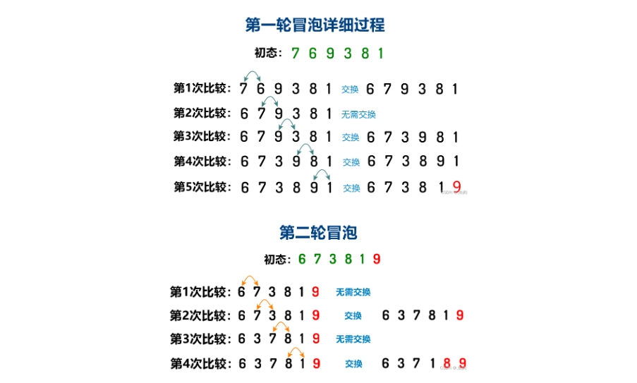
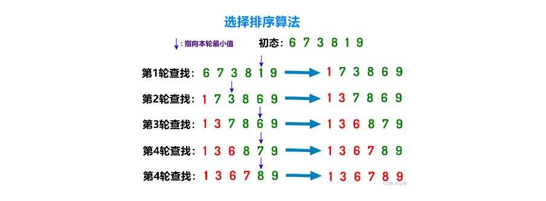
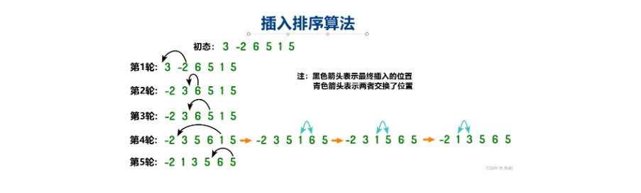
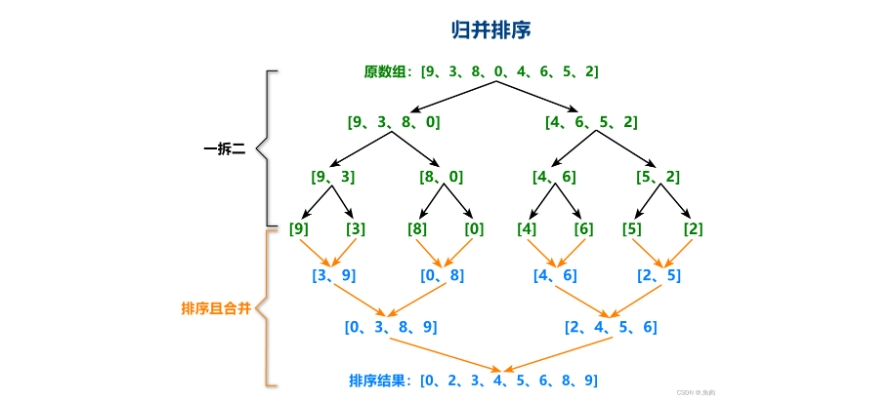

## 0x00. 排序算法
经典算法十大排序包括：冒泡排序、选择排序、插入排序、希尔排序、归并排序、快速排序、堆排序、计数排序、桶排序、基数排序；
排序算法可以分为内部排序和外部排序，内部排序是数据记录在内存中进行排序，而外部排序是因排序的数据很大，一次不能容纳全部的排序记录，在排序过程中需要访问外存。

## 0x01. 冒泡排序
冒泡排序是一种最基本的排序方法，循环比较每两个相邻数字，让大的数字在右，小数字在左，这样遍历一轮后最大数字即可达到最顶端，遍历n-1轮即可实现排序，就像水泡一样向上，所以形象的称为冒泡排序。  
冒泡排序的操作对象是数组，可以实现稳定排序，因为需要内层循环和外层循环遍历，所以时间复杂度为$O(n^2)$，冒泡排序不需要额外开辟新空间，空间复杂度为$O(1)$。  

   

```C++
void bubble_sort(vector<int> &nums,int n) {
    bool swapped;
    for(int i=1 ; i < n;i++) {
        swapped = false;
        for(int j=1;j<n-i+1;j++) {
            if(nums[j] < nums[j-1]) {
                swap(nums[j],nums[j-1]);
                swapped = true;
            }
        }
        if(!swapped) {
            break;
        }
    }
}
```
## 0x02. 选择排序
这个算法就是我们笔算排序用的算法。在一组数中找出最小的一个排在第一个位置，然后在剩下的数中找一个次小的排第二位，再找剩下元素中第三小……。但是用计算机实现其实还略微有点不同，我们要在原来的位置上交换，而非重新创建一个数组。  
选择排序因为每次都要遍历一遍找到最小，所以排序对象既可以是链表，也可以是数组。在遍历过程中，如果存在两个相等元素，后者会被排序到前面位置，所以选择排序是不稳定的。选择排序也有内层循环和外层循环两层遍历，所以时间复杂度为$O(n^2)$，其不需要额外开辟新空间，空间复杂度为$O(1)$。

```C++
void selection_sort(vector<int> &nums, int n) {
    int index;
    for (int i=0 ; i<n-1 ; i++) {
        index = i;
        for(int j=i+1;j<n;j++) {
            if(nums[j]<nums[index]) {
                index = j;
            }
        }
        swap(nums[index],nums[i]);
    }
}
```
## 0x03. 插入排序
插入排序把待排序数组分为两部分，一部分是排序好的有序区，另一部分是待排序的无序区，每次从无序区中抽取第一个数据，加入到有序区中，从最后一个元素开始向前依次比较，最终插入到合适的位置。  
插入排序适用于数组和链表，时间复杂度为$O(n^2)$，空间复杂度为$O(1)$。可以保证不交换相同的原始数据位置，所以是稳定的。  

```C++
void insert_sort(vector<int> &nums,int n) {
    for(int i=0 ; i<n ; i++) {
        for(int j=i; j>0 && nums[j]<nums[j-1] ; j--) {
            swap(nums[j],nums[j-1]);
        }
    }
}
```
## 0x04. 堆排序
首先要了解堆这种数据结构，首先堆是一种完全二叉树，堆中每个节点的值都大于或小于其他子树中任何节点的值，分为大顶堆和小顶堆，大顶堆是上大下小，小顶堆是上小下大。除此之外都是不成熟的堆，还在堆化的路上。在堆排序过程中，使用数组存储大顶堆。  
堆化：顺着节点所在路径，向上或向下比较，然后交换节点。
- 节点下标为i的父节点下标：(i-1)/2 【整数除法】；
- 节点下标为i的左孩子下标：i x 2 + 1 ；
- 节点下标为i的右孩子下标：i x 2 + 2 ；  

首先将n个元素的数组构造成一个大顶堆，然后将堆顶元素（0号元素）与最后一个元素交换，这样就将最大值放在了数组最后（n-1的位置），然后把数组长度减1，再将这n-1长度的数组重新构造成大顶堆，再把堆顶元素与新长度的数组最后的元素进行交换（n-2的位置）元素交换位置，如此往复最后就能将原数组从后向前的排序完成。其难点是堆的重构部分。有两种写法，一种是递归，一种是非递归。非递归写法如下：
```C++
//堆化:构建大顶堆
void ShiftDown(int *arr, int heapSize, int k) {
    while (2 * k + 1 < heapSize) {  // 在 k节点的所有子元素中执行一下步骤
        int i = 2 * k + 1;  // i为k的左孩子
        if (i + 1 < heapSize && (arr[i + 1] > arr[i]))  // 如果其右孩子在需排序的长度范围内，且左孩子小于右孩子
            i += 1; //该节点遍历结束，
        if (arr[k] >= arr[i])   //当k结点大于该节点终止循环
            break;
        swap(arr, k, i);    //不符合堆定义，交换元素位置
        k = i;  //更新节点交换后的位置
    }
}
 
void HeadSort(int *arr, int arrLen) {
    int i;
    for (i = (arrLen - 1) / 2; i >= 0; --i)
        ShiftDown(arr, arrLen, i);  // 建立初始堆
    for (i = arrLen - 1; i > 0; --i) {
        swap(arr, 0, i);    //交换首尾元素，第i次排序完成
        ShiftDown(arr, i, 0);   // 重构堆（i记录了上次发生交换的结点）
    }
}
```
递归写法：
```C++
void heapSort(vector<int> &arr,int heapSize,int i) {
    int largest = i;
    int lson = 2*i+1,rson = 2*i+2;
    if(lson < heapSize && arr[lson] > arr[largest]) {
        largest = lson;
    }
    if(rson < heapSize && arr[rson] > arr[largest]) {
        largest = rson;
    }
    if(largest!=i) {
        swap(arr[largest],arr[i]);
        heapSort(arr,heapSize,largest);
    }
}
//堆排序入口
void heap_sort(vector<int>& arr,int heapSize) {
    //建堆
    for(int i=heapSize/2-1;i>=0;i--) {
        heapSort(arr,heapSize,i);
    }
    //排序
    for(int i=heapSize-1;i>0;i--) {
        swap(arr[i],arr[0]);
        heapSort(arr,i,0);
    }
}
```
## 0x05. 快速排序
快速排序在C++中可以直接通过sort()函数实现，但是还是要了解其基本原理。快速排序的思想是，选择一个序列的一个元素，把小于此元素的数据放在左边，大于此元素的数据放在右边，然后分成了左右两个区间，再递归的处理这左右两个区间，直到整个序列排序完成。  
操作方法：选定一个数组的第一个元素作为基准，保存到key中，从后向前遍历，直到找到小于key的元素，填充到第一个位置，然后再从前向后遍历，找到大于key的元素填充到最后一个位置，此处第一个和最后一个位置不是固定的，前一个元素在哪里交换了，下一个元素就填到哪里来。例如：第一次保存了下标为0的元素，所以从后向前遍历找到大于key的元素i就填到index=0位置处，第二次从前向后遍历，找到小于key的元素就填到位置i处，依次类推。  
快速排序的平均时间复杂度为$O(nlog(n))$，最坏时间复杂度为$O(n^2)$。
```C++
void quick_sort(vector<int> &nums,int l,int r) {
    if(l+1>=r) {
        return;
    }
    //在处理时，first=l , last=r-1 采用了左闭右闭写法
    int first=l , last=r-1,key=nums[first];
    while (first < last) {
        while (first < last && nums[last] >= key) {
            --last;
        }
        nums[first] = nums[last];
        while (first < last && nums[first] <= key) {
            ++first;
        }
        nums[last] = nums[first];
    }
    nums[first] = key;
    quick_sort(nums,l,first);
    quick_sort(nums,first+1,r);
}
```
## 0x06. 归并排序
归并排序采用了分治的思想，首先将待排序的数组拆分成两数组，两个拆四个，直到最后每个数组都只由一个元素组成的（这样的每个数组都是有序的），然后俩俩“合并”，此合并非彼合并，我们仍需遍历两个数组，在这两个数组中的几个元素中重新排序（这个重新排序的结果需要临时保存在大小合适的新数组中），不过因为原来两个数组都是有序的，所以当我们操作完其中一个数组的全部元素后，如果另一个数组还有剩余的元素，直接将它们放在后面即可。算法图解如下：
  
归并排序既可以操作数组也可以操作链表，其时间复杂度为$O(nlog(n))$。
```C++
void merge_sort(vector<int>& nums,int l,int r,vector<int>& temp) {
    if(l+1>=r) {
        return;
    }
    //划分
    int m = l +(r-l)/2; //计算中间位置为r-l
    merge_sort(nums,l,m,temp);
    merge_sort(nums,m,r,temp);
    //合并
    int p=l,q=m,i=l;
    while(p<m || q<r) {
        if(q >= r || (p<m && nums[p]<=nums[q])) {
            temp[i++] = nums[p++];
        }else {
            temp[i++] = nums[q++];
        }
    }
    for(i=l;i<r;i++) {
        nums[i] = temp[i];
    }
}
```
https://blog.csdn.net/weixin_64811333/article/details/128702619